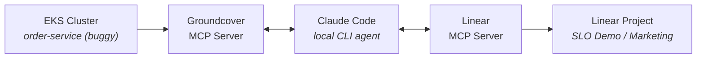

# SLO Remediation Demo with Groundcover

**Autonomous SLO breach detection → diagnosis → Linear ticket → code patch**

This demo shows how [Groundcover's](https://groundcover.com) eBPF-based observability platform powers an AI-driven SLO remediation workflow — from zero-instrumentation monitoring to autonomous incident response.

You'll walk through:

1. **Deploying a buggy microservice** to EKS with an intentional N+1 query pattern
2. **Installing the Groundcover eBPF sensor** to get full observability (metrics, traces, logs) with no code changes or sidecars
3. **Generating load** to trigger SLO breaches that Groundcover detects automatically
4. **Running an AI agent** ([Claude Code](https://docs.anthropic.com/en/docs/claude-code)) that connects to Groundcover via [MCP](https://modelcontextprotocol.io/) (Model Context Protocol) to autonomously detect breaches, diagnose root causes from distributed traces, file incident tickets in [Linear](https://linear.app), and suggest code fixes

No custom agent code is needed — the workflow is defined entirely in a [`CLAUDE.md`](CLAUDE.md) file that Claude Code follows, using Groundcover and Linear MCP servers as its tools.

## Architecture



## Agent Flow

1. **Detect** — queries Groundcover for workloads with p99 > 500ms
2. **Diagnose** — pulls traces to identify the slow endpoint and root cause (N+1 pattern)
3. **Ticket** — files a Linear issue with detection data, root cause analysis, and suggested fix
4. **Patch** — outputs before/after code blocks for the fix

The workflow is defined in [`CLAUDE.md`](CLAUDE.md) — Claude Code follows it automatically when prompted.

## Project Structure

```
├── buggy-service/              # The intentionally slow FastAPI service
│   ├── main.py                 # N+1 sleep bug on POST /orders
│   ├── Dockerfile
│   └── requirements.txt
├── k8s/                        # Kubernetes manifests
│   ├── namespace.yaml
│   └── order-service.yaml
├── load-gen/                   # Traffic generator
│   └── load_gen.py
├── deploy.sh                   # EKS deployment script
├── CLAUDE.md                   # Agent workflow instructions
├── .claude/                    # Claude Code config
│   └── settings.json.example   # OTEL telemetry config template
├── .env.example                # Environment variable template
└── README.md
```

## Prerequisites

- AWS CLI configured (`eksctl`, `kubectl`, Docker)
- [Claude Code](https://docs.anthropic.com/en/docs/claude-code) installed
- Groundcover account with MCP access
- Linear workspace with a Marketing team and "SLO Demo" project
- Linear API key with full permissions (https://linear.app/settings/api)

## Quick Start

### 1. Configure environment

```bash
# MCP credentials and deployment config
cp .env.example .env
# Fill in your Groundcover and Linear API keys

# Claude Code OTEL telemetry (optional — sends traces to Groundcover)
cp .claude/settings.json.example .claude/settings.json
# Fill in your OTEL endpoint and auth header
```

### 2. Deploy the buggy service to EKS

```bash
chmod +x deploy.sh
./deploy.sh
```

This creates an EKS cluster, deploys `order-service`, installs Groundcover, and runs load generation.

### 3. Generate traffic

```bash
# Port-forward and run load
kubectl -n slo-demo port-forward svc/order-service 8000:80 &
python3 load-gen/load_gen.py http://localhost:8000 --rps 2 --duration 120
```

~70% of multi-item orders will breach the 500ms SLO.

### 4. Run Claude Code as the SLO agent

```bash
claude
```

Then prompt:

```
Run the SLO workflow
```

Claude Code reads `CLAUDE.md`, queries Groundcover MCP for breaching workloads, diagnoses via traces, files a Linear ticket, and suggests a code fix.

## Environment Variables

| Variable | Description |
|---|---|
| `GROUNDCOVER_API_KEY` | Groundcover API key (Bearer token) |
| `GROUNDCOVER_MCP_URL` | Groundcover MCP endpoint |
| `GROUNDCOVER_TENANT_UUID` | Groundcover tenant UUID |
| `GROUNDCOVER_BACKEND_ID` | Groundcover backend ID |
| `GROUNDCOVER_TIMEZONE` | Timezone for queries (default: America/Chicago) |
| `LINEAR_API_KEY` | Linear API key (full permissions) |
| `CLUSTER_NAME` | EKS cluster name (default: slo-demo-cluster) |
| `AWS_REGION` | AWS region (default: us-east-2) |
